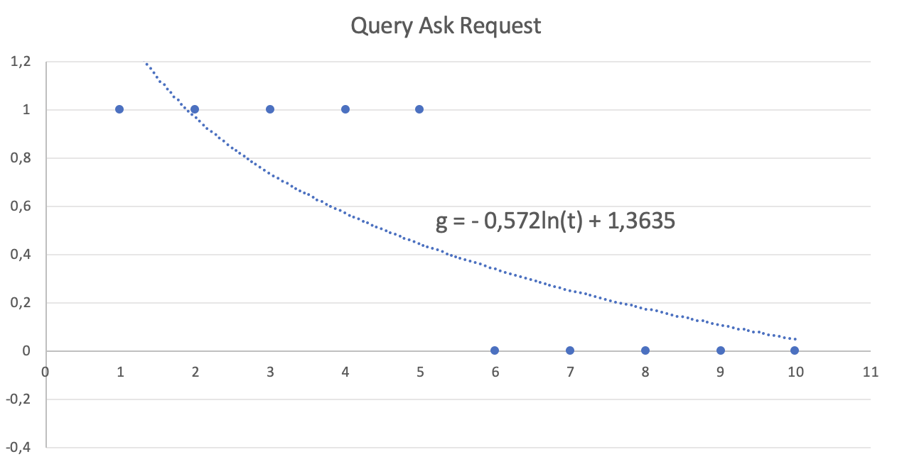
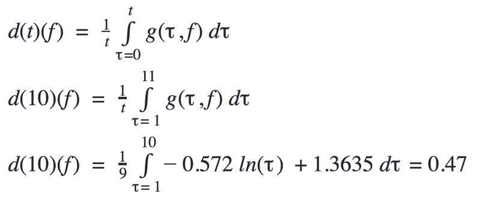
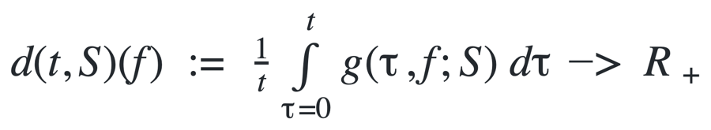

“客户如何发现最好的矿工来进行存储和检索处理呢?”

这是Filecoin 生态系统的一个关键挑战.

信誉系统的目的就是帮助解决这个问题。理想情况下，生态系统应该只有一个信誉系统，因为具有不同计算信誉得分方法的信誉系统可能会产生相互矛盾的结果，从而造成混淆。信誉系统就是这样一个系统，Filecoin 生态系统的每个参与者都可以参考它。

信誉评分的目的是通过一个单一的数字来量化一个矿工在储存和检索交易中的可靠性，以便客户在选择矿工时能够做出明智的选择。在初始版本中，评分仅仅捕获与存储交易中矿工的可靠性相关的方面。

下面描述的公式是信誉评分的核心，它表达了评分中最重要的直播，及矿工在存储交易中的可靠性。尽管如此，这个公式并不是详尽，将来可以根据协议的发展和社区的反馈来进一步完善。

此外，信誉得分本身并不能说明全部问题，还有其他因素必须权衡: 价格，位置，自由空间等。

*note：如何考量带宽因素？ 以及服务质量水平的SLA呢？*

信誉系统基于大量的链上和链下数据点所收集的矿工指标。其中一些指标用于计算上述矿工的总体得分。其他度量可用于对矿工进行筛选和分类，以帮助存储客户根据预期用例(速度、地理位置、矿机性能、价格等)选择最佳矿工。

##信誉评分
评分的目的是用一个数字来量化这个矿工在存储交易上的可靠程度。评分被分成几个部分，以涵盖影响成功的存储交易的各个方面。 

1.  矿工们的最高得分是100分
2. 分数基于3个主要指标，每个指标在总分中有不同的权重:

* 在线可达性——30%权重
* 承诺扇区证明指标-30% 权重
* 交易指标——40% 权重

###  在线可达性评分

启动存储交易的第一步是询问这家矿工有关其 FIL 价格的情况。如果这个请求失败，就不可能继续存储过程，而且矿工必须受到处罚。信誉系统定期询问矿工。为了计算可达性得分，考察成功/失败请求随时间的分布情况。

Request successful (reachable) = 1

Request failed (unreachable) = 0

成功和失败的请求按对数标度绘制，以便及时观察一个矿工的行为。

简而言之，如果两个矿工在给定时间段内拥有相同数量的成功和失败请求，那么在更接近当前时间内响应更多成功次数的矿工得分更高。该系统给予近期表现良好的矿工更高的奖励。

可达性评分是根据以下数学公式计算的:

t = 周期时间
g = 满足分布曲线的对数方程

结果是区间[0,1]中的一个数字，其中1是满分。得分为1的矿工获得30分，得分为0.86的矿工获得0.86 * 30 = 25.8分。

演示计算方法的最简单示例是考虑一个接收到10个 QueryAsk 请求的矿工。假设前5个请求是成功的，但由于各种原因，最后5个请求失败。如果在一个坐标系上绘制这个分布图，其垂直轴表示请求的成功(1或0) ，水平轴表示时间轴，可以得到一个适合这个分布图的对数曲线。

将公式中的曲线方程替换，并计算结果:

在这种情况下，矿工得到0.47 * 30 = 14.1分

注意: 有些矿工只接受私有的、离线的交易，可能选择不响应 lotus 客户机的query——ask。尽管声誉系统惩罚他们不对任何人开放，但这并不意味着他们的服务不优秀，可以私下联系这些矿工进行存储交易。信誉系统提供的其他信息应有助于客户了解这些矿共提供的服务质量。

###承诺的扇区证明评分
在将已承诺扇区容量升级为交易扇区之前，矿共向网络提交承诺储存能力的证明将获得奖励。为了满足存储需求，尽可能减少故障是很重要的。

含义:

d(t, S) : S是扇区时空的时间平均运行故障分布；t 时间维度
f: 故障事件

g(τ,f;S) ：扇区时空S的瞬时故障密度τ的估计函数f

S:  扇区时空，定义为扇区大小乘以扇区寿命

最后的结果是一个范围[0,1]的数字，其中1是完美的分数。得分为1的矿工会得到30分的奖励。得分为0.3的矿工将获得30 * 0.3 = 10个声誉积分。

###交易评分
评分的第3个组成部分反映了矿工成功运行存储交易的比例。达成存储交易是矿工的衣食父母，这个组成部分有最大的权重。

对于每个矿工，我们计算一个交易分数，声誉分数是基于这个分数分配的。只有交易而没有罚款的矿工将获得40分的满分。如果一些交易被取消，矿主将受到处罚。

为了计算得分，只考虑活跃的交易。由于某种原因在交易变得活跃之前被取消的交易对得分没有影响。我们还区分了由于技术原因而放弃的交易和由于矿工的决定而放弃的交易。两者都会受到惩罚，但后者受到的惩罚更多。

由于技术原因而放弃交易 = 交易存储的扇区被终止，但故障已被宣告。

由于矿商的决定而放弃交易 = 交易存储的行业被终止，并且没有错误报告。

为了计算交易评分，我们使用以下系数:

* 每笔交易的价值没有处罚: 1(这是交易的最高价值)
* 由于技术原因放弃交易:-2
* 由于矿商的决定而放弃了交易:-4

计算交易得分的例子: 一个矿工总共有100笔交易，其中：

1.  90宗是没有罚款的交易
2. 7宗交易因技术原因被取消
3. 由于矿工的决定，3宗交易被取消

交易得分 = 90 * 1 + 7 * (- 2) + 3 * (- 4) = 90-14-12 = 64。
信誉 = 64 * 40/100 = 25.6。

如果 示例中的非满分矿工是同一个的话，那么该矿工的总信誉分是 14.1+10+25.6=49.7分。

## 信誉评分系统的API

Filecoin Reputation API 是一套高性能的 RESTful JSON 端点，专门用于发现最佳的矿工以进行存储和检索处理。这个 API 包括所有的技术文档开发人员需要集成第三方应用程序和平台。请求的 url 由 https://api.filrep.io/api 组成，后面跟着与所需请求相关联的端点。

### API 参数
返回与矿工相关的所有指标。此信息包括原始能力、正常运行时间、位置、评分、交易统计等详细信息。
<table>
<tr> <th>Query Parameter </th><th>type	</th><th>Description</th>
<tr> <th>offset	</th><th>
string</th><th>
Number of miners to be skipped. Example: 0
<tr> <th>limit</th><th>	
string</th><th>
The length of response Example: 10
<tr> <th>sortBy	</th><th>
string</th><th>
Sorting option. Valid: "uptime", "rawPower", "qualityAdjPower", "freeSpace", "score", "averageStorageDealsPrice", "noPenalties", "dataStored"
<tr> <th>order	</th><th>
string</th><th>
Option to order miners. Valid: "asc", "desc"
<tr> <th>search	</th><th>
string</th><th>
Keyword to search miners by. Example: "f0010"
<tr> <th>region	</th><th>
string</th><th>
Option to filter miners by region. Valid: "Asia", "Europe", "Africa", "Oceania", "South America", "Central America", "North America"
</table>

**Responses: 200 Successful**

矿工相关：
<table>
<tr> <th>miners</th><th>type </th><th>
Results of your query returned as an array
<tr> <th>address</th><th>	
string</th><th>
The address of the miner. Example: f01001
<tr> <th>status	</th><th>
boolean</th><th>
Indicates the response for the latest query ask request. Example: true
<tr> <th>uptimeAverage	</th><th>
number </th><th>
Miner uptime score
<tr> <th>price	</th><th>
string (attoFIL)</th><th>
The latest price requested by miner. Example: 50000000000
<tr> <th>rawPower	</th><th>
string (bytes) </th><th>
The latest raw power value from miner. Example: 34000000
<tr> <th>qualityAdjPower	 </th><th>
string (bytes) </th><th>
The latest quality adj power value from miner. Example: 34000000
<tr> <th>isoCode	</th><th>
string</th><th>
The ISO code of miner's country. Example: ES
<tr> <th>city	</th><th>
string</th><th>
The city where miner is located. Example: Barcelona
<tr> <th>region	</th><th>
string</th><th>
The region where miner is located. Example: Europe
<tr> <th>freeSpace	</th><th>
string (bytes)</th><th>
Miner's available free space. Example: 34000000
<tr> <th>storageDeals.total	</th><th>
number</th><th>
The total number of miner's storage deals. Example: 100
<tr> <th>storageDeals.noPenalties	</th><th>
number </th><th>
The number of miner's successful storage deals. Example: 80
<tr> <th>storageDeals.successRate	</th><th>
number </th><th>
The ratio of successful storage deals to failed ones. Example: 0.8
<tr> <th>storageDeals.averagePrice	</th><th>
string (attoFIL) </th><th>
The average price requested by miner for storage deals. Example: 1000000
<tr> <th>storageDeals.dataStored	 </th><th>
string (bytes) </th><th>
The amount of data stored by the miner from the beginning. Example: 10000000000
<tr> <th>storageDeals.slashed	 </th><th>
number </th><th>
A number representing for how many times the miner was slashed. Example: 1
<tr> <th>scores.total	</th><th>
number</th><th>
Miner's overall score. Example: 95
<tr> <th>scores.uptime	</th><th>
number </th><th>
Miner uptime score. Example: 30
s<tr> <th>cores.storageDeals	</th><th>
number </th><th>
Miner storage deals score. Example: 35
<tr> <th>scores.committedSectorsProofs	</th><th>
number </th><th>
Miner committed sectors proofs score. Example: 30
</table>

分页查询：
<table>
<tr> <th>pagination </th><th>type </th><th>
Pagination data
<tr> <th>total	</th><th>
number </th><th>
The total number of miners. Example: 100
<tr> <th>offset	</th><th>
number </th><th>
Number of skipped miners. Example: 10
<tr> <th>limit	 </th><th>
number </th><th>
The number of miners in response. Example: 10
</table>

###缓存策略
允许对矿工数据进行本地缓存，以支持应用程序的操作。如果应用程序有一个重要的用户基础，并且关心保持在 API 速率限制之内，那么可以考虑实现一个数据缓存策略。

### 防御性编程

通过防御性编程实现一个高可用性的 REST API 服务，以尽量减少集成错误的影响。请注意，任何版本更改，特别是主版本更改，都可能引入响应格式或端点配置中的更改，而且，现有的端点随着时间的推移仍然可能引入新的属性。因此，需要：

1. 仔细地将 API 响应解析为 JSON，而不是通过 Regex 或其他方式
2. 解析逻辑应该只优先考虑需要的响应属性，以保证其他更改或新字段被忽略
3. 为不可能发生的不一致(数据类型或空值)做好准备。可以通过向响应解析逻辑添加健壮的字段验证来防止这种情况。这些问题的影响可以通过使用编程语言提供的安全机制最小化,例如try/catch 块语句

